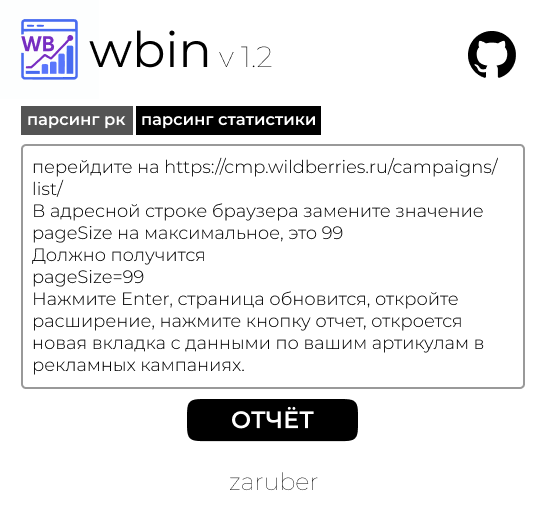

# WBin

Простое расширение для Google Chrome, которое позволяет просматривать данные API v5 вместо v6 на сайте Wildberries.

## Установка

1. Скачайте или клонируйте этот репозиторий на свой компьютер
2. Откройте Google Chrome и перейдите на страницу `chrome://extensions/`
3. Включите "Режим разработчика" (переключатель в правом верхнем углу)
4. Нажмите на кнопку "Загрузить распакованное расширение"
5. Выберите папку с файлами расширения (папку, где находится manifest.json)
6. Расширение будет установлено и готово к использованию

## Использование

### Для страницы списка кампаний:

1. Перейдите на страницу `https://cmp.wildberries.ru/campaigns/list/all`
2. Дождитесь полной загрузки страницы и данных
3. Нажмите на иконку расширения в панели инструментов
4. Расширение найдет последний запрос к API v6, заменит его на API v5 и покажет результаты в новой вкладке
5. В результатах отображаются как сырые данные в формате JSON, так и таблица с основной информацией о кампаниях

### Для страницы статистики:

1. Перейдите на страницу `https://cmp.wildberries.ru/campaigns/statistics/all`
2. Дождитесь полной загрузки страницы и данных
3. Нажмите на иконку расширения в панели инструментов
4. Расширение найдет последний запрос к API статистики и покажет его данные в новой вкладке
5. В результатах отображаются как сырые данные в формате JSON, так и таблица со статистическими данными

## Функциональность

Расширение выполняет следующие функции:
- Отслеживает запросы к API на страницах Wildberries
- При нажатии на иконку расширения создает нужный запрос с сохраненными заголовками
- Отображает результаты запроса в новой вкладке в зависимости от режима:
  - Для списка кампаний: JSON + таблица с основными данными кампаний
  - Для статистики: JSON + таблица со статистическими данными

## Отображаемые данные в таблице

### Таблица кампаний (для страницы списка кампаний)

Таблица содержит следующие колонки:
- **ID** - идентификатор рекламной кампании
- **Название кампании** - название рекламной кампании
- **Артикул** - артикул товара, размещенного в кампании

### Таблица статистики (для страницы статистики)

Таблица содержит следующие колонки:
- **ID Кампании** - идентификатор рекламной кампании
- **Артикулы** - артикулы товаров в кампании
- **Показы** - количество просмотров
- **Клики** - количество кликов
- **CTR (%)** - показатель кликабельности
- **CPC** - стоимость клика
- **CR (%)** - коэффициент конверсии
- **Корзины** - количество добавлений в корзину
- **Заказы** - количество заказов с учетом ассоциированных конверсий
- **Затраты** - сумма затрат

## Примечания

- Для работы расширения необходимо находиться на одной из поддерживаемых страниц:
  - `https://cmp.wildberries.ru/campaigns/list/all`
  - `https://cmp.wildberries.ru/campaigns/statistics/all`
- Если нужный запрос не был найден, расширение покажет соответствующее уведомление
- Все данные обрабатываются локально в вашем браузере
- Для экспорта данных используйте соответствующие кнопки:
  - Экспорт в Excel (CSV) для удобного анализа - все числовые данные автоматически форматируются с использованием запятой в качестве десятичного разделителя для корректного отображения в русской версии Excel
  - Копирование в буфер обмена для быстрой вставки в Google Sheets или другие приложения 