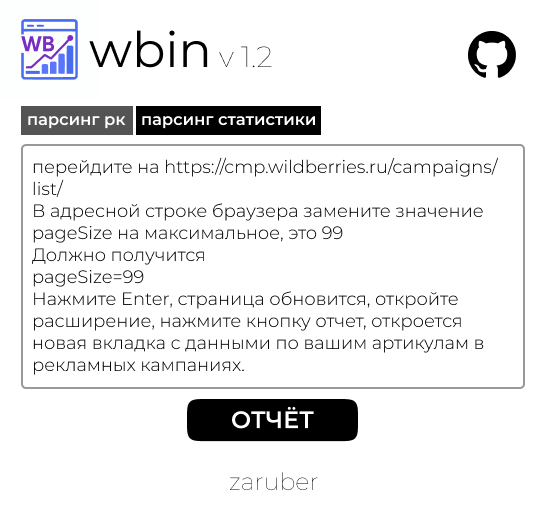

# WBin - Расширение для Wildberries

Расширение для скачивания реклам с их артами, статистики рк и ее ассоциированных конверсий с лк вб простым способом, в удобном формате.

## Возможности

### 1. Парсинг кампаний
- Извлечение данных о рекламных кампаниях и артикулах
- Поддержка API v5 и v6
- Автоматическое зеркалирование запросов

### 2. Парсинг статистики
- Анализ эффективности рекламных кампаний
- Получение детальной статистики по кампаниям

### 3. Анализ АСК (Ассоциированные конверсии) 🆕
- **Новая функция!** Детальный анализ ассоциированных конверсий
- Красивый интерфейс в стиле Apple в отдельной вкладке
- Поддержка множественных ID кампаний
- Агрегация данных по нескольким кампаниям
- Копирование результатов в буфер обмена

## Установка

1. Скачайте или клонируйте репозиторий
2. Откройте Chrome и перейдите в `chrome://extensions/`
3. Включите "Режим разработчика"
4. Нажмите "Загрузить распакованное расширение"
5. Выберите папку с файлами расширения

## Использование

### Парсинг кампаний
1. Перейдите в [свои кампании](https://cmp.wildberries.ru/campaigns/list/)
2. Установите `pageSize=99` в URL для максимального количества записей
3. Нажмите кнопку "Получить отчёт" в расширении

### Парсинг статистики
1. Перейдите в [статистику кампаний](https://cmp.wildberries.ru/campaigns/statistics/)
2. Установите `pageSize=50` в URL для полного списка
3. Нажмите кнопку "Получить отчёт" в расширении

### Анализ АСК
1. Убедитесь, что вы авторизованы в [ЛК Wildberries](https://cmp.wildberries.ru/)
2. В расширении перейдите на вкладку "Анализ АСК"
3. Нажмите кнопку "Получить отчёт"
4. В открывшейся вкладке введите ID рекламы и выберите период
5. Получите детальный анализ ассоциированных конверсий

## Файлы проекта

- `popup.html` - Главное окно расширения
- `popup.js` - Логика попапа
- `popup.css` - Стили попапа
- `ask.html` - Страница анализа АСК
- `ask.js` - Логика анализа АСК
- `ask.css` - Стили страницы АСК
- `background.js` - Фоновый скрипт
- `content.js` - Контентный скрипт
- `manifest.json` - Манифест расширения

## Автор

Создано [@zaruber](https://t.me/real_zaruber)

## Поддержка

Присоединяйтесь к [Telegram чату](https://t.me/+3g9fjC4OTn03MWYx) для обновлений и вопросов по WBin. 
